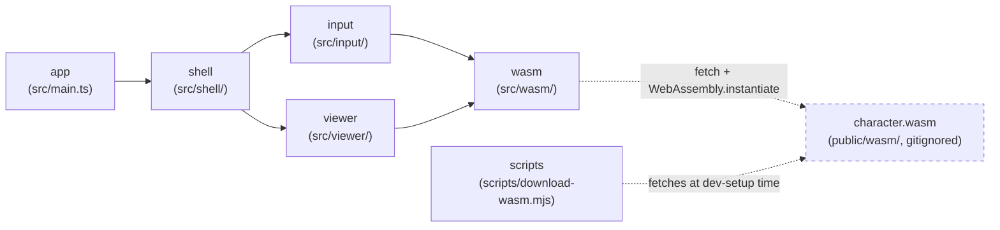

> Generated by /vibe:docs — manual edits will be overwritten; use README for hand-written content.

# Architecture

## Big picture

`character-viewer-web` is a static, backend-less site. All character parsing
happens client-side, in the browser, through a WebAssembly module built from
the sibling [`character`](https://github.com/openkakutou/character) Go
library — this repo never reimplements `.def`/`.air`/`.sff`/`.cns` parsing
itself.

- **`app`** (`src/main.ts`, `src/version.ts`, `src/style.css`) — the entry
  point. Delegates the whole UI to `shell`, forwarding the app version and
  any injectable WASM bridge options.
- **`shell`** (`src/shell/`) — the launch screen → workspace transition
  (item 020). `launch-screen.ts` renders a full-frame wrapper around
  `input`'s existing file-input view; nothing else exists on screen until a
  character loads. Once it does, `workspace-shell.ts` replaces it entirely
  with a persistent `<wuik-app-shell>`: a toolbar (app title/version, the
  character's name) plus a vertical `<wuik-tabs orientation="vertical">`
  unit holding one `<wuik-tab-panel>` per `viewer` screen (Characteristics,
  Palette, Sprites, Animation) — composed as a single piece laid out as a
  narrow tab-list column beside a wide content column via CSS Grid on the
  component's own host element, since `<wuik-tabs>` has no supported way to
  split its list from its content across `<wuik-app-shell>`'s own
  sidebar/main slots (see
  `.vibe/decisions/011-workspace-shell-tabs-composition-and-section-switch-detection.md`).
  Every section is rendered once and stays mounted — `<wuik-tabs>` only
  toggles a panel's `hidden` attribute when switching, never destroying or
  re-rendering it, which is how each section keeps its own selection,
  expanded groups, and playback position across switches for free. A single
  `MutationObserver` watching every panel's `hidden` attribute drives the
  two behaviors `<wuik-tabs>` itself has no event for: pausing the
  animation player when its section stops being visible, and moving focus
  to the newly visible section's own heading.
- **`input`** (`src/input/`) — the character file input. `character-file-input.ts`
  holds the DOM-free logic: it accumulates the 4 required files
  (`.def`/`.air`/`.sff`/`.cns`) across any number of picker/drop gestures,
  validates them (missing kind, same-gesture duplicate kind, unreadable
  file — see `.vibe/decisions/004-character-file-input-interaction-model.md`),
  and calls into `wasm` once all 4 are present. `character-file-input-view.ts`
  renders the file-picker + drag-and-drop UI on top of that logic.
- **`viewer`** (`src/viewer/`) — screens that display an already-loaded
  character's data, each hosted as one section of `shell`'s workspace
  (item 020; each screen's own render function is unchanged by that move —
  see `.vibe/decisions/005-characteristics-panel-inline-no-tab-navigation-yet.md`
  and `.vibe/decisions/008-sprite-browser-stays-inline-tab-navigation-still-deferred.md`
  for why tab/sidebar navigation was deliberately deferred until now).
  `characteristics-panel.ts` renders the Characteristics section: name,
  animation count, total sprite count, and the sorted list of Statedef
  numbers. `sprite-browser.ts` renders the Sprites section: a collapsed-by-default list of
  sprite groups (expanding one lazily mounts only its own sprites, so a
  sheet with hundreds of sprites never dumps hundreds of DOM rows at once)
  and a preview `<canvas>` that decodes and shows the selected sprite's
  actual pixels on demand via `wasm`'s `resolveSpritePixels`, scaled to fit
  a fixed-size stage (`computeScaleToFit`) — see
  `.vibe/decisions/007-sprite-preview-raw-canvas-not-wuik-viewport.md` for
  why this is a plain `<canvas>` rather than `web-ui-kit`'s `<wuik-viewport>`.
  `animation-player.ts` renders the Animation section: plays an `Animation`'s
  `Frame`s back on a `setTimeout` chain paced by each frame's own `time`
  (in game ticks, `MS_PER_TICK` = 1/60s), decoding and drawing the current
  frame's sprite the same way the sprite browser does, reusing its
  `computeScaleToFit`/`defaultDrawPixels`. Reaching the end of the frame
  list stops playback unless looping is on, in which case it wraps to the
  animation's `loopStart`. A frame using the `.air` "no sprite" sentinel
  (any negative group/image value) shows as an empty frame instead of
  attempting a decode. An optional overlay draws each frame's `Clsn1`/`Clsn2`
  boxes, offset by the sprite's axis point, directly onto the same
  native-resolution canvas as the sprite pixels so it stays pixel-aligned
  at any zoom — see
  `.vibe/decisions/009-animation-player-timing-looping-and-collision-overlay-design.md`
  for the timing, looping, and overlay-color decisions none of this was
  specified upstream. `palette-picker.ts` (item 006) shows which `.act`
  files the character's `.def` references (informational only — this app
  never has their bytes) and lets the user upload one as an external
  override, probe-validated against a real sprite before being applied —
  see `.vibe/decisions/010-palette-picker-scope-and-external-override-only.md`
  for why an embedded-bank picker isn't possible with the current WASM
  contract, and "Data flow: applying a palette override" below.
- **`wasm`** (`src/wasm/`) — the bridge to the `character` WebAssembly
  module. `bridge.ts` loads `wasm_exec.js` and instantiates `character.wasm`
  client-side (both fetched from `public/wasm/`, which is gitignored — see
  "WebAssembly dependency" below), then exposes a typed `loadCharacter(...)`
  wrapper around the module's `OpenKakutouCharacter.load` global, plus a
  `resolveSpritePixels(...)` wrapper around `OpenKakutouCharacter.resolveSprites`
  for decoding a specific sprite's actual on-screen pixels on demand — never
  part of `loadCharacter`'s own JSON contract, which only ever carries
  sprite metadata. `types.ts` is the TypeScript mirror of the module's JSON
  contract (`CharacterData` and its nested shapes) — pure data types, no
  parsing logic.
- **`scripts`** (`scripts/download-wasm.mjs`) — dev-only tooling, not part
  of the shipped app bundle. Fetches a pinned `character` release's
  `character.wasm` + `wasm_exec.js` into `public/wasm/` so contributors
  don't need a Go toolchain or a sibling `character` checkout.

## WebAssembly dependency

`public/wasm/` (the `character.wasm` binary and its `wasm_exec.js` loader)
is fetched, never committed — see `docs/development.md` for how to fetch it
locally. Once fetched, `wasm/bridge.ts` loads `wasm_exec.js` by executing
its source via `new Function(source)()` rather than a `<script>` tag or
`import()`, so the same loading code behaves identically in a real browser
and under the test suite's jsdom environment (`.vibe/decisions/002-wasm-bridge-loading-and-result-shape.md`).

## Data flow: loading a character

1. The user picks or drops files onto `shell`'s launch screen, which hosts
   `input`'s view unchanged.
2. `input`'s logic classifies each file by extension, accumulates it into a
   per-kind slot, and — once all 4 required kinds are filled with no
   unresolved conflict — reads each file's bytes (via `FileReader`, not
   `Blob#arrayBuffer()`, since the latter is unimplemented in the project's
   pinned jsdom version and this way test and browser behavior match).
3. The 4 byte buffers are handed to `wasm.loadCharacter`, which calls the
   WebAssembly module's `OpenKakutouCharacter.load` and parses its
   `{character, error}` JSON result into a typed `CharacterResult`.
4. `input`'s view reports success (character loaded) or a typed failure
   (a specific unreadable file, or the WASM module's own parse error) back
   to the caller — never a thrown exception at any layer.
5. On success, `shell` replaces the launch screen entirely with the
   workspace shell, passing the loaded `CharacterData` — and the raw
   `.sff` bytes just read, threaded through unchanged (see
   `.vibe/decisions/006-sff-bytes-threaded-through-load-result-for-on-demand-pixel-decode.md`)
   — to every `viewer` section's own render function, all mounted at once
   inside their `<wuik-tab-panel>`. Only Characteristics starts visible;
   the rest wait behind the sidebar. Reloading the page starts over from
   step 1 — session state (loaded character, active section) is not
   persisted across a reload.
6. Selecting a sprite in the sprite browser is a separate, later
   round trip: it calls `wasm.resolveSpritePixels` with the `.sff` bytes
   from step 5 and just that one sprite's `(group, image)`, decoding pixels
   only for the sprite actually selected. A slower response for an
   already-superseded selection is discarded rather than overwriting a
   newer one's preview.
7. The animation player follows the same on-demand decode pattern per
   frame as it plays, steps, or loops — each frame change triggers its own
   `resolveSpritePixels` round trip (also discarding a superseded response),
   rather than pre-decoding a whole animation's frames up front.

## Data flow: applying a palette override

1. `palette-picker.ts` reads `CharacterData.palettes` (referenced `.act`
   file path strings from the `.def`'s `[Files]` section) and shows them as
   plain informational text — this app only ever loaded the 4 required
   character files, so it never has these files' actual bytes.
2. Uploading any `.act` file reads its bytes (`readFileAsBytes`, shared
   with `input`) and probe-validates them with one real `resolveSpritePixels`
   call against the character's own first sprite, surfacing whatever error
   the WASM bridge itself returns (e.g. a wrong byte count) rather than a
   client-side length check — a same-size non-palette file still fails
   this way, since the WASM module actually tries to decode it.
3. Once validated, the override bytes are handed to `app` via
   `onPaletteChange`, which forwards them to a small handle each of
   `renderSpriteBrowser`/`renderAnimationPlayer` now returns
   (`setPaletteOverride`) — re-resolving only the *currently shown*
   sprite/frame with the new override, not a full re-render, so neither
   screen loses its current selection, expanded groups, or playback state.
4. A character switch (a fresh `onLoaded` call) always starts every screen,
   including the palette picker, from a brand-new closure with no override
   — nothing from a previous character's override bytes can carry forward
   by construction.
